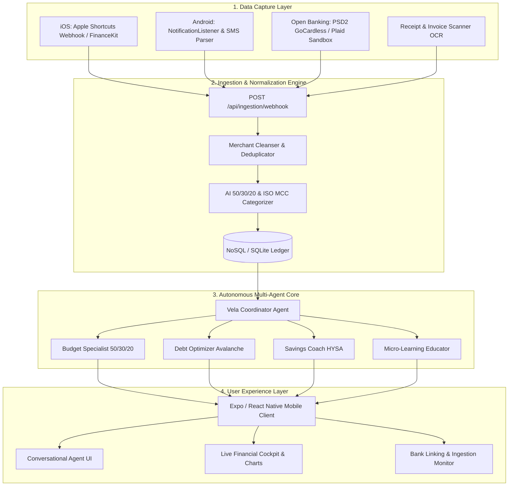

# Vela: System Architecture Specification & Implementation Blueprint

**Project:** Vela — Multi-Agent Personal Financial Advisor & Automated Data Ingestion Platform  
**Document Type:** Technical Architecture Design & Development Roadmap (BSc Thesis)  
**Author:** Akbermet Toktobekova  

---

## 1. Architectural Vision & System Overview

Vela is engineered to eliminate the fundamental friction point of personal finance management: **manual data entry**. By aggregating real-time on-device payment events (NFC / Apple Pay / Google Wallet), background push/SMS notifications, and European Open Banking (PSD2) streams into a unified ingestion pipeline, Vela continuously powers an autonomous multi-agent advisory system.



---

## 2. Deep-Dive Component Breakdown

### 2.1 Component 1: Multi-Source Data Ingestion Engine

| Channel | Platform | Technical Hook | Latency | Data Captured |
| :--- | :--- | :--- | :--- | :--- |
| **NFC Tap-to-Pay** | iOS | Apple Shortcuts Webhook (`Automation -> Payment`) | `< 1s` | Amount, Raw Merchant, Card, Timestamp |
| **Push Interception** | Android | `NotificationListenerService` | `< 0.1s` | Bank Notification Body, Title, Package Name |
| **Bank SMS Parser** | Android | `BroadcastReceiver (SMS_RECEIVED)` | `< 0.5s` | Transactional SMS, Balance residue |
| **Open Banking API**| Cross-platform | GoCardless (Nordigen) / Plaid PSD2 API | Batch / Webhook | Full ledger, IBAN transfers, MCC codes |
| **Receipt Scanner** | Cross-platform | Tesseract / Vision OCR API | On-demand | Itemized grocery bills, store metadata |

#### Standardized Ingestion Data Contract
```json
{
  "source": "android_notification | ios_shortcut | open_banking | receipt_ocr",
  "account_id": "acc_revolut_vault_01",
  "raw_text": "Paid 4,500 HUF at SPAR Corvin via Google Wallet",
  "amount": 4500.0,
  "currency": "HUF",
  "raw_merchant": "SPAR CORVIN BUDAPEST HU",
  "transaction_type": "DEBIT | CREDIT | TRANSFER",
  "timestamp": "2026-08-24T07:30:00Z"
}
```

---

### 2.2 Component 2: Normalization & AI Enrichment Layer

Raw financial logs are transformed into actionable financial intelligence through a 3-step pipeline:

1. **Merchant Normalization:** Removes noisy POS terminal artifacts (`"POS 0923 STARBUCKS #102 HU"` ➔ `"Starbucks"`).
2. **50/30/20 Framework & MCC Mapping:**
   - **Needs (50%):** Supermarkets, utilities, public transit, healthcare.
   - **Wants (30%):** Coffee, restaurants, entertainment, fashion.
   - **Savings/Liabilities (20%):** Loan payments, emergency fund deposits.
3. **Deduplication Engine:** Automatically pairs pending NFC webhooks with confirmed bank ledger settlements using timestamp proximity ($\Delta t \le 180s$) and amount matching.

---

### 2.3 Component 3: Autonomous Multi-Agent Core (CrewAI)

* **Vela Coordinator (`agents/coordinator.py`):** Evaluates incoming transaction velocity and intent, routing data to specialized agents.
* **Budget Specialist (`agents/budget_agent.py`):** Tracks live cash burn rate against the 50/30/20 benchmark and alerts on discretionary spending spikes.
* **Debt Optimizer (`agents/debt_agent.py`):** Calculates mathematically optimal debt payoff (Debt Avalanche: highest APR first) when liability balances fluctuate.
* **Savings Coach (`agents/savings_agent.py`):** Identifies surplus inflows (e.g. salary deposits) and prepares 1-tap automated allocation proposals towards milestones.
* **Micro-Learning Educator (`agents/microlearning_agent.py`):** Synthesizes 2-minute context-aware lessons and quizzes based on recent spending patterns.

---

### 2.4 Component 4: Unified Mobile Client (Expo / React Native)

* **Conversational Interface (`ChatScreen`):** Displays messages tagged with agent roles, action checklists, and interactive response pills.
* **Live Financial Cockpit (`DashboardScreen`):** Visualizes 50/30/20 ratios, debt amortization progress, and savings milestone trajectories.
* **Bank & Ingestion Hub (`BankingSyncScreen`):** Allows users to link bank accounts (OTP, Revolut, Wise), configure on-device shortcuts, and trigger the **Interactive NFC Tap Simulator**.
* **Daily Bite (`MicroLearningScreen`):** Gamified daily financial lessons with streak counters and instant knowledge checks.

---

## 3. Step-by-Step Implementation Roadmap

```
Phase 1: Ingestion & Bank Hub  ➔  Phase 2: Normalizer & Rules  ➔  Phase 3: Real-Time Event Triggers
           │                                │                                    │
           ▼                                ▼                                    ▼
Phase 4: Mobile Bank Cockpit   ➔  Phase 5: Contextual Micro-Learn➔  Phase 6: Evaluation & Defense
```

### 📋 Phase 1: Ingestion Pipeline & Bank Synchronization
* [ ] Create `backend/services/ingestion.py` supporting Apple Shortcuts, Android listener webhooks, and PSD2 payloads.
* [ ] Implement Open Banking Sandboxes (GoCardless / Plaid schemas for European banks: OTP, Revolut, Wise, Erste).
* [ ] Build REST API routes in `backend/api/routes_ingestion.py` (`POST /webhook`, `GET /accounts`, `GET /transactions`).

### 📋 Phase 2: AI Transaction Normalizer & Categorization
* [ ] Implement regex-based and embedding-assisted merchant cleaner in `backend/services/normalizer.py`.
* [ ] Develop automatic 50/30/20 bucket tagger with custom category overrides.
* [ ] Build deduplication logic matching instant point-of-sale events with posted bank statements.

### 📋 Phase 3: Real-Time Agent Event Triggers
* [ ] Connect the Ingestion Engine directly to the Multi-Agent Core.
* [ ] Add automatic threshold triggers (e.g. Discretionary spending $> 35\% \rightarrow$ Budget Specialist alert).
* [ ] Add Salary / Inflow trigger ($\rightarrow$ Savings Coach emergency fund allocation proposal).

### 📋 Phase 4: Mobile Bank Hub & Interactive NFC Tap Simulator
* [ ] Develop `BankingSyncScreen.tsx` in Expo: manage connected accounts (Revolut, OTP, Apple Wallet).
* [ ] Build **Interactive NFC Simulator Modal**: allows user or thesis examiner to simulate an instant NFC tap payment (`€4.50 at Cafe`) and watch it appear live on the dashboard within milliseconds.
* [ ] Create real-time transaction history feed with filterable category badges.

### 📋 Phase 5: Dynamic Micro-Learning Linked to Spending Habits
* [ ] Connect daily micro-lessons to real user behavior (e.g. high credit balance triggers *Debt Avalanche* lesson).
* [ ] Add quiz streak rewards and celebration animations.

### 📋 Phase 6: Performance Evaluation & Thesis Finalization
* [ ] Benchmark ingestion latency, categorization accuracy, and agent response times.
* [ ] Document ethical considerations: data privacy, on-device processing, and PSD2 compliance.
* [ ] Package final thesis figures, architecture diagrams, and user guide.

---

*Specification maintained by the Vela Development Team.*
